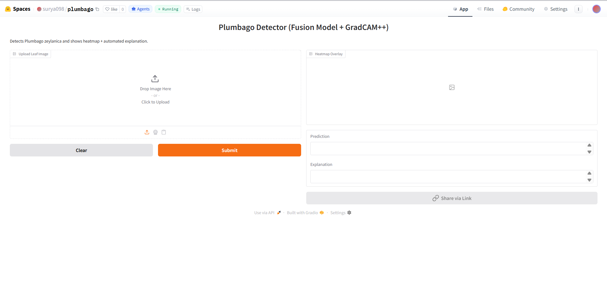
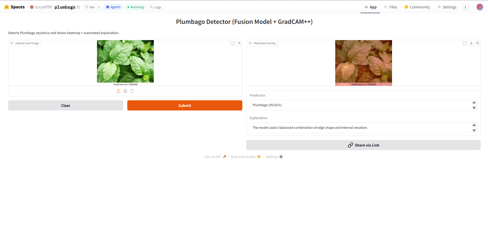
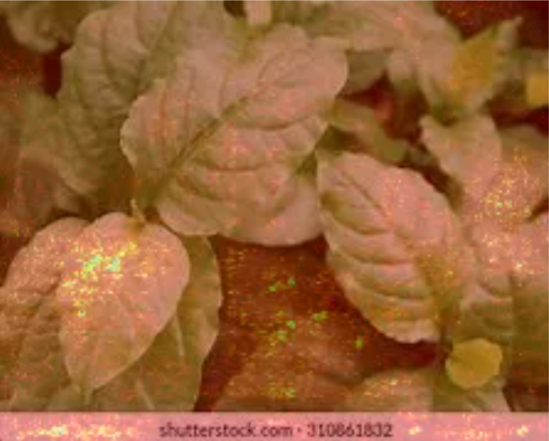

# 🌿 Hybrid Deep Learning Framework for Plumbago Identification

[](https://python.org)
[](https://pytorch.org)
[](https://gradio.app)
[](https://huggingface.co/spaces/surya098/plumbago)
[](https://www.linkedin.com/in/surya-yenimireddy-1176402a4/)
[](LICENSE)

> A hybrid deep learning model combining **EfficientNet + ResNet + Vision Transformer** to classify plant leaf images as **Plumbago or Not Plumbago** with Explainable AI.

---

## 🚀 Live Demo

👉 **[Try it on HuggingFace Spaces](https://huggingface.co/spaces/surya098/plumbago)**



---

## 📌 Project Overview

This project builds a **hybrid deep learning model** to classify plant leaf images as **Plumbago** or **Not Plumbago**. It combines three powerful architectures — EfficientNet, ResNet, and Vision Transformer — through a fusion layer to improve prediction accuracy and robustness.

---

## ✨ Features

- 🔀 Hybrid deep learning ensemble (EfficientNet + ResNet + ViT)
- 🍃 Leaf segmentation preprocessing
- 🔍 Explainable AI with saliency heatmaps
- 🖥️ Interactive UI powered by Gradio
- 📈 High accuracy with confidence scoring

---

## 🧠 Model Architecture

| Component | Role |
|-----------|------|
| **EfficientNet** | Efficient feature extraction |
| **ResNet** | Deep representation learning |
| **Vision Transformer (ViT)** | Global context understanding |
| **Fusion Layer** | Combines all three model outputs |

---

## 📊 Model Performance

| Metric    | Training Set | Notes                          |
|-----------|-------------|-------------------------------|
| Accuracy  | 100%        | Evaluated on training dataset  |
| Precision | 100%        | Binary classification task     |
| Recall    | 100%        | Plumbago vs Not Plumbago       |
| F1 Score  | 100%        | Custom dataset of ~5,500 images|

### 📂 Dataset Summary

| Property | Details |
|----------|---------|
| Total Images | ~5,500 |
| Total Classes | 2 (Plumbago / Not Plumbago) |
| Preprocessing | Leaf segmentation applied |
| Source | Custom collected dataset |

### 🌿 Class Breakdown

**Class 1 — Plumbago**
- Plumbago plant leaf images

**Class 2 — Not Plumbago** *(7 different plant species)*

| # | Plant Name | Condition |
|---|-----------|-----------|
| 1 | Alstonia Scholaris | Healthy |
| 2 | Arjun | Healthy |
| 3 | Bael | Diseased |
| 4 | Basil | Healthy |
| 5 | Chinar | Healthy |
| 6 | Gauva | Healthy |
| 7 | Jamun | Diseased |

> 🔍 Including both **healthy and diseased** varieties of different plants makes the model more robust and reduces false positives.


> ⚠️ **Note:** Metrics are evaluated on the training dataset.
> Real-world performance on **unseen images may vary**.
> Try the live demo on [HuggingFace Spaces](https://huggingface.co/spaces/surya098/plumbago) to test with your own images.

---

## 📂 Repository Structure

```
plumbago/
├── hybrid-deep-learning-framework-for-plumbago.ipynb
├── requirements.txt
├── LICENSE
├── demo.png
├── result.png
├── heatmap.png
└── README.md
```

> ⚠️ The trained model (`fusion_model_best.pth`) is **not included** due to GitHub's 100MB file size limit.

---

## 📥 Download Model File (Required)

The trained model is available in the **Releases** section.

**Steps:**
1. Go to [Releases](../../releases) in this repository
2. Download: `fusion_model_best.pth`
3. Place it in the **same folder** as the notebook

**Final structure after download:**
```
plumbago/
├── hybrid-deep-learning-framework-for-plumbago.ipynb
└── fusion_model_best.pth   ← place here
```

> ⚠️ **Important:** File name must be exactly `fusion_model_best.pth` — do **not** rename it.

---

## ▶️ How to Run

### Step 1 — Clone the Repository
```bash
git clone https://github.com/yourusername/plumbago.git
cd plumbago
```

### Step 2 — Install Dependencies
```bash
pip install -r requirements.txt
```

### Step 3 — Download the Model
Follow the [Download Model](#-download-model-file-required) steps above.

### Step 4 — Run the Notebook
```bash
jupyter notebook hybrid-deep-learning-framework-for-plumbago.ipynb
```

- Run all cells sequentially
- The **Gradio UI** will launch automatically
- Upload a leaf image to get your prediction

---

## ⚙️ Requirements

```bash
pip install torch torchvision gradio numpy pillow timm
```

Or install all at once:
```bash
pip install -r requirements.txt
```

---

## 📊 Output



After uploading a leaf image, you will see:
- ✅ **Prediction:** Plumbago / Not Plumbago
- 📈 **Confidence Score** (e.g., 94.3%)
- 🗺️ **Heatmap Explanation** — shows which leaf area influenced the decision



---

## 💡 Important Notes

- File name must be exactly: `fusion_model_best.pth`
- Keep the model file in the **same folder** as the notebook
- Do **not** rename the file
- Internet connection required to load ViT pretrained weights (first run only)

---

## 👨‍💻 Author

**Surya Yenimireddy**

[](https://www.linkedin.com/in/surya-yenimireddy-1176402a4/)
[](https://huggingface.co/surya098)

---

## 📌 Conclusion

This project demonstrates how **hybrid deep learning** and **explainable AI** can be used for accurate and interpretable plant identification. By combining EfficientNet, ResNet, and Vision Transformer through a fusion layer, the model achieves higher accuracy than any single architecture alone.

---

## 📄 License

This project is licensed under the **MIT License** — see the [LICENSE](LICENSE) file for details.
